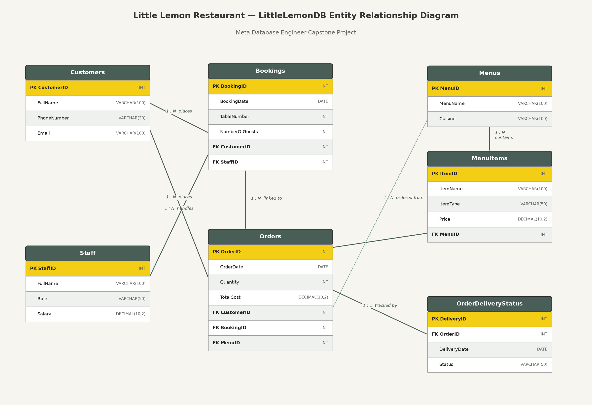

# Little Lemon Restaurant Booking System

### Meta Database Engineer Capstone Project

A complete database solution for the Little Lemon restaurant: a MySQL data model
with a booking system, stored procedures for managing bookings, a Python client
for interacting with the database, and Tableau data analysis.

---

## Project Structure

| File / Folder | Description |
|---|---|
| `LittleLemonDB.sql` | Full database schema, sample data, stored procedures and views |
| `LittleLemonDB_ER_Diagram.png` | Entity Relationship diagram showing all table connections |
| `LittleLemon_Booking_System.ipynb` | Jupyter notebook — connects to MySQL with Python and calls all procedures |
| `screenshots/` | PNG screenshots of each stored procedure's output |
| `Tableau/` | Tableau analysis documentation (worksheets and dashboard) |

## Database Schema

The `LittleLemonDB` database contains seven tables:

- **Customers** — customer names and contact details
- **Staff** — staff information including role and salary
- **Bookings** — table bookings (date, table number, guests) linked to customers and staff
- **Orders** — order date, quantity and total cost, linked to bookings and menus
- **Menus** — menu names and cuisines
- **MenuItems** — starters, courses, drinks and desserts belonging to each menu
- **OrderDeliveryStatus** — delivery date and status for each order



## How to Set Up

1. Open **MySQL Workbench** and connect to your MySQL server.
2. Go to **Server → Data Import → Import from Self-Contained File** and select
   `LittleLemonDB.sql` (or simply open the file and execute it).
3. The `LittleLemonDB` database is created with all tables, sample data,
   stored procedures and views.

## Stored Procedures

| Procedure | Purpose | Example call |
|---|---|---|
| `GetMaxQuantity()` | Displays the maximum ordered quantity in the Orders table | `CALL GetMaxQuantity();` |
| `ManageBooking()` | Checks whether a table is already booked on a given date | `CALL ManageBooking('2022-11-12', 3);` |
| `AddBooking()` | Adds a new booking record | `CALL AddBooking(9, 3, 4, '2022-12-30');` |
| `UpdateBooking()` | Updates the date of an existing booking | `CALL UpdateBooking(9, '2022-12-17');` |
| `CancelBooking()` | Cancels (deletes) an existing booking | `CALL CancelBooking(9);` |
| `AddValidBooking()` | Adds a booking inside a transaction; rolls back if the table is taken | `CALL AddValidBooking('2022-12-17', 6);` |
| `CheckBooking()` | Reports the booking status of a table on a given date | `CALL CheckBooking('2022-11-12', 3);` |

Output screenshots for every procedure are in the [`screenshots/`](screenshots) folder.

## Python Client

`LittleLemon_Booking_System.ipynb` uses `mysql-connector-python` to:

1. Establish a connection to the MySQL server
2. Show all tables in `LittleLemonDB`
3. Run a JOIN query returning customers with orders over $60
4. Call each stored procedure (`GetMaxQuantity`, `ManageBooking`, `AddBooking`,
   `UpdateBooking`, `CancelBooking`) and display the results

```bash
pip install mysql-connector-python jupyter
jupyter notebook LittleLemon_Booking_System.ipynb
```

## Tableau Analysis

The Tableau workbook analyses the Little Lemon sales data and includes:

- **Customers sales** — bar chart of customers and sales, filtered to costs ≥ $70
- **Profit chart** — line chart of sales profit per year
- **Sales bubble chart** — bubble chart of sales for all customers
- **Cuisine sales and profits** — bar chart of sales for the three most popular cuisines
- **Dashboard** — combining the bar chart and the sales bubble chart

See [`Tableau/Tableau_Analysis.md`](Tableau/Tableau_Analysis.md) for the
step-by-step build instructions.
